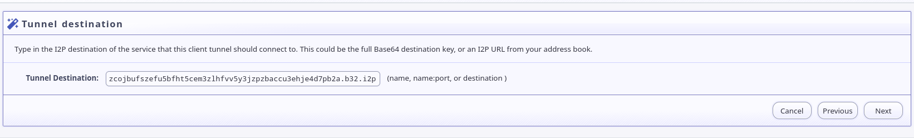

Connecting to my Nethack/DGamelaunch Server
===========================================


Running Battle for Multiuser Nethack over I2P is possible using "Standard"
streaming tunnels.

1. First, set up a client tunnel: 
 - 
2. Pick a "Standard" tunnel for your tunnel type:
 - 
3. Set a tunnel name and description:
 - 
4. Enter: `zcojbufszefu5bfht5cem3zlhfvv5y3jzpzbaccu3ehje4d7pb2a.b32.i2p` as the destination:
 - 
5. Pick a local host and port. This is the port you will `telnet` to to connect.
 - 
6. Decide whether you want the tunnel to start automatically:
 - 
7. Make sure the settings look ok, and save the new tunnel:
 - 

It may improve performance to reduce the length of your tunnel. Since playing
Multiuser Nethack is a mostly low-risk activity, I recommend visiting the
`nethack.idk.i2p` tunnel on the [I2P Tunnel Manager Page, http://127.0.0.1:7657/i2ptunnelmgr](http://127.0.0.1:7657/i2ptunnelmgr)
and changint the settings to use short, 1-hop tunnels. These are the tunnel
settings I use.

- Fine-tune your settings. : 

Then you can connect to the Nethack server by running the command:

```bash
telnet localhost 7680
```

If you would rather set up your tunnel by dropping in a configuration file,
you can use this one: [i2ptunnel-nethack.conf](i2ptunnel-nethack.config) or
copy-paste the section below.

```properties
interface=127.0.0.1
listenPort=7680
name=nethack.idk.i2p
option.i2cp.closeIdleTime=1800000
option.i2cp.closeOnIdle=false
option.i2cp.delayOpen=false
option.i2cp.destination.sigType=7
option.i2cp.leaseSetEncType=4,0
option.i2cp.newDestOnResume=false
option.i2cp.reduceIdleTime=1200000
option.i2cp.reduceOnIdle=true
option.i2cp.reduceQuantity=1
option.i2p.streaming.connectDelay=0
option.inbound.backupQuantity=2
option.inbound.length=1
option.inbound.lengthVariance=0
option.inbound.nickname=nethack.idk.i2p
option.inbound.quantity=3
option.outbound.backupQuantity=2
option.outbound.length=1
option.outbound.lengthVariance=0
option.outbound.nickname=nethack.idk.i2p
option.outbound.quantity=3
option.persistentClientKey=true
option.useSSL=false
privKeyFile=i2ptunnel-nethack-privKeys.dat
sharedClient=false
startOnLoad=true
targetDestination=zcojbufszefu5bfht5cem3zlhfvv5y3jzpzbaccu3ehje4d7pb2a.b32.i2p
type=client
```
